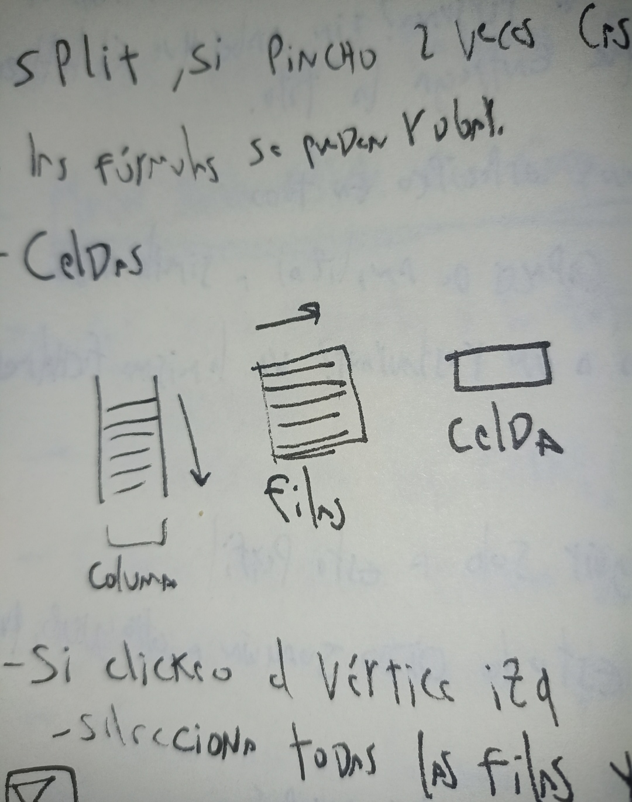
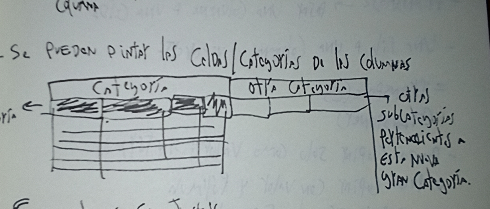

# taller martes 17 marzo

## primera parte

corrección a grupo 1: not.nyko

- lo eligieron porque les gustaban las fotos que él tomaba
  
- mantuvo su estética de colores y fotografía a través de sus años en la

- profes: es bueno contextualizar, hacer marcos temporales, hitos importantes

- tomaron en cuenta los planos de las fotos, se repiten planos fotográficos

- variaron para seleccionar las fotografías

- martín: es interesante el concepto de dump, se podría diferenciar un dump de un no dump

- sergio: es interesante que muestren su perfil secundario y no el principal

- el grupo dividió ubicaciones de esta persona, santiago, valpo, etc

- profes: quizá esta persona le saca fotos a un determinado objeto, quizá un objeto específico se repite

- mientras más específicas las cosas que abordamos, mejor, mientras más antecedentes tengamos, mejor

- poner link a las fotos en la tabla puede ser buena idea

GRUPO FEEDBACK Y OBSERVACIONES PROPIAS, CUBOTOY (MI GRUPO)

- se podría relacionar el tema de la postura con la personalidad de cubo, quizá en la época de verano está más feliz y suele posar de forma más relajada, poco seria en las fotos

- sube hartas cosas de vacaciones

-  profes: es bueno que aparezco una tabla de relaciones sociales

-  profes: cada una de las categorías se pueden especificar más

-  cómo sistematizar algo, ejemplo: las prendas que utiliza, hay alguna prenda que utilice más o repita?

-  mientras más podemos ahondar es mejor, ej: podemos determinar su rango de vestimenta

-  podríamos también determinar qué hace en la ciudad que va siempre (caldera), hay algún lugar específico que visite? alguna comida que repita? a qué cosas les toma foto en caldera?

-  debiéramos diferenciar más las categorías o juntar/eliminar algunas. Ejemplo: retrato en el trabajo podrían ser una misma o juntas

-  buscar en qué ambitos podemos ahondar y desglosar más aún

-  sergio: ***HACER DOBLE CLICK EN CADA COSA***

-  joaquín: si yo le pregunto a la foto, esta por sí misma me debe dar información, hay que ponerse en el contexto de que esta persona no conoce a cubotoy como ustedes

-  joaquín: ver los porcentajes de las cosas, qué cosas se repiten. Cuando las cosas comienzan a tener diferentes cantidades es cuando aparecen los valores

-  joaquín: alguien que no conoce a cubotoy, probablemente le interese más su trabajo que su vida personal

-  joaquín: pensar en cómo usa este material, cuántas veces usó este color, qué porcentaje de color hay en sus trabajos, cuantas veces repitió algo dentro de sus trabajos, qué plumón usó, trazo, material

-  ***EL PERSONAJE Y SU OBRA*** me parece un concepto interesante, reconocer el personaje según su obra, ejemplo: juntar a 7 profes y sin saber nada sólo reconocer por las estadísticas de la obra quién la hizo

-  hacer una subcategoría sobre los post dijo la vale, se fijó en que siempre la primera foto en los dump es de él y la segunda es de su pareja, un factor a considerar

-  joaquín: la idea es pasar de inferimos qué a concluímos qué

-  personalmente siento que hay que ser muy específico en todo, descubrir algo que no somos capaces de analizar a simple vista, esas son las cosas que deben aparecer

-  ¿va a caldera las mismas fechas todos los veranos? cambiará el més o día? le gustará más ir en febrero o enero?

feedback que dió a otro grupo, no recuerdo bien cuál

- les sugirió crearse cuentas y seguir solo a esta persona o a 10 cuentas y comparar, les aparecería en el feed constantemente a las mismas horas, ver a qué horas publicaba esta persona todos los días, mirar y recopilar

- las citas, colaboraciones, menciones, palabras que se repitan, dan más información que texto sin contexto

- personas con obra, obra y personaje ---> importante analizar esto

### segunda parte: EXCEL

- la última parte de la clase estuvimos viendo Excel de la mano de Joaquín

- columnas se identifican con letras ---> aquí van características y diferencias

- filas con números ---> son los sujetos de estudio

-  fx= split, si pincho 2 veces una casilla se abre la fórmula que ésta contiene

-  las fórmulas se pueden robar

- si clickeo el vértice izq selecciona todas las filas y columnas

- la herramienta crear filtro sirve para filtrar para todos o filtrar para mí

- si deslizo con un ícono de mano, esto hace que quede fijo el dato y que cuando scrollee este no se desplace

herramientas que nos sirven

- split, sirve para dividir, en cuántas columnas quiero dividir?

- find and replace --> ejemplo: esto find las comas y replace con puntos, es decir, encuentra las comas y reemplázalas con puntos en un rango definido que yo te daré

- se pueden pintar las celdas/categorías de las columnas

- ej: concatenar es juntar, puedo concatenar joaquín y gonzález las veces que necesite

- si yo tomo una celda, se mueve la fórmula y el número?

- debo entender mejor lo de las fórmulas

- puedo sumar arrastrando la fórmula hacia el lado, la fórmula se puede arrastrar de una celda a otra

- sumif significa sumar si es mayor a tal número, es como los if en c++

- copiar fórmula y reemplazar los valores para el caso específico que necesitemos

- transpose --> sirve para pasar una columna a fila y viceversa, nos sirve para dar vuelta la tabla x así decirlo, significa transponer

- puedo copiar sólo el valor y sin fórmula o puedo copiar con valor y fórmula o copiar sólo la fórmula? se pueden estas 3 opciones?

- sort to a-z de más nuevo a más viejo

- sort to z-a significa de más viejo a más nuevo

PARA EL VIERNES

- necesitamos tablas del estilo visto en clases

- categorías claras, fechas, rangos

- elemnentos que se utilicen sean comparables

- mucho texto distinto no es comparable, palabras que se repiten sí, traer resultados de análisis

-  
